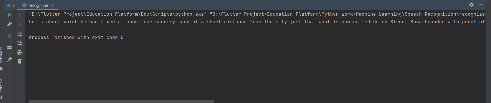

# [How to Convert Speech to Text in Python](https://www.thepythoncode.com/article/using-speech-recognition-to-convert-speech-to-text-python)
To run this:
- `pip3 install -r requirements.txt`
- To recognize the text of an audio file named `Audio/Happy.wav`:
    ```
    python recognizer.py `Audio/Happy.wav`
    ```
    **Output**:
    ```
    I believe you're just talking nonsense
    ```
- To recognize the text from your microphone after talking 5 seconds:
    ```
    python Live Recognizer.py 5
    ```
# Output File 
    
    This will record your talking in 5 seconds and then uploads the audio data to Google to get the desired output.
